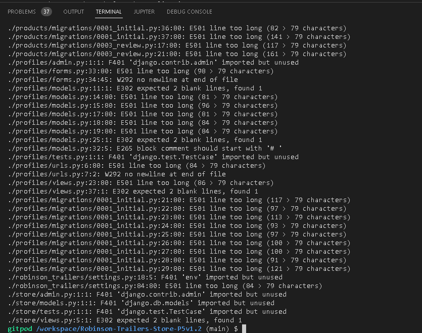

# Robinson Trailers Store

This is the fifth and last portfolio project for the Code Institute Diploma in Fullstack Software Development and E-Commerce Applications. Web Application Store is dedicated to a real trailers manufacturing company. Located in Portarlington Co. Laoise.
Robinson Trailers is created for customers seeking to purchase trailers online. Users can create accounts and administrators have full write and delete access to all data.

[You can view the deployed site](https://robinson-trailers-store.herokuapp.com/)

- [Table of Contents](#table-of-contents)
    + [Project Overview](#project-overview)
    + [Agile Workflow](#agile-workflow)
    + [User Stories](#user-stories)
    + [User Experience Strategy](#user-experience-strategy)
    + [Structure](#structure)
    + [Technical Design](#technical-design)
    + [Wireframes](#wireframes)
    + [Existing Features](#existing-features)
    + [Features Yet to Implement](#features-yet-to-implement)
    + [Technologies Used](#technologies-used)
      - [Languages](#languages)
      - [Frameworks, Libraries and Other Resources](#frameworks--libraries-and-other-resources)
      - [Database](#database)
    + [Testing](#testing)
    + [Other Services](#other-services)
    + [Validation](#validation)
    + [Deployment](#deployment)
    + [Performance](#performance)
    + [Accessibility](#accessibility)
    + [Bugs](#bugs)
    + [Credits](#credits)
    + [Reference](#reference)

<small><i><a href='http://ecotrust-canada.github.io/markdown-toc/'>Table of contents generated with markdown-toc</a></i></small>

### Project Overview

Robinson Trailers an assignment for the Code Institute Diploma in Full Stack Software Development. I chose this company for my project because I work for it on part time. Each photo in the project was taken by me. For the project, I used a single photo for a given trailer. More detailed and technical photos can be seen on socal media such as Linkedin, Instagram, Facebook, Pinterest, Twiter or videos on Tik Tok. After searching for Robinson Trailers.

This store meant to be applicable in a real world scenario. Except of the price being fictional of course. The price is given only for the show of working functions such as sorting the product. From the lowest price to the highest and from highest to the lowest price.

The company offers many different trailers for different sectors, for example I have listed these sectors in the dropdown menu call categories like forestry, construction or special orders.

The focus points for this application are ecommerce, using the Django framework and the ability to go through with a payment for an order.

### Agile Workflow

I have tried to implement the basic Agile strategy, creating issues for my user stories, a Kanban board for the project, Milestones for each epic and moving the stories from to do to done.

[View the Project Kanban board](https://github.com/FabrizioAdi/Robinson-Trailers-Store-P5v1.2/projects/1)

## User Stories

#### User goals:

1. Availability on various devices.
As a user, I can access the website from any device, so that I have access to the website on desktop, tablet and mobile.
2. Trailers Informations.
As a user, I can read more information about the trailers (description, images, price), so that I can see if the product is right for me and meets my or the company's needs.
3. Social Media
As a user, I can access the social media accounts of the company, so that I can follow them and see the latest updates.
4. Website Navigation
As a user, I can be able to navigate easily through the website, so that I can find everything easily.
5. General Information
As a user, I can read and know more about the company, so that I know what the company is about.
6. Contact, Asking Questions
As a user, I can be able to contact the owner/admin of the company website, so that I can easily ask a question.
7. Account Registration
As a user, I can register an account, so that I can leave comment or contact admin and be up to date about the latest news.
8. Search/Filter 
As a user, I can search or filter by category diffrent type of trailers, so that I can find specific trailer quick and easy.
9. Login
As a user, I can simple login to the website, so that I have access to all available options, especially secure payment.
10. Display message
As a user, I would like to see the message that I am logged in, so that I can be sure that I am successfully logged in or logout.
11. Remove trailers from cart
As a user, I can remove trailer from cart, so that I can easily use remove button to remove trailers from my cart.
12. Facebook link
As a user, I can see a link in the footer to the site’s Facebook Business Page, so that I can follow the company on Facebook.
13. Account cancelation
As a user, I can choose to inactivate my account, so that I can cancel my account at any time.
14. Trailers list
As a user, I can be able to display a list of all available trailers for sale on the site, so that I can find the product that I looking for.
15. Email confirmation
As a user, I should confirm my email address, so that I can complete my account registration process.
16. Contact
As a user, I can contact with the site admin or owner, regardless of whether I am signed in or not, so that I can send message with a question.
17. Cart content
As a user, I can view the products added to my cart by clicking the cart icon, so that I can check what is added to my cart.
18. Total quantity
As a user, I can adjust the quantity of the product chosen after adding it to the shopping cart, so that I can view the trailers quantity added to the cart.
19. Adding to cart
As a user, I can add a trailers to my cart from the product detail page, so that I can purchase the trailers.
20. Total cost
As a user, I can see the total price of my cart in the navigation bar, so that I know what the total cost will be.
21. Review
As a user, I can write a review and rate a product in the list, so that other users can benefit from my review.
22. Trailer detail
As a user, I can be able view the trailers after clicking on image from the products list, so that I can view and read the products details.
23. Read review
As a user, I can read other user reviews about the products that they purchase and used, so that I can think if the product is right for me and whether it is worth buying.
24. Successful payment
 As a user, I want to be informed of whether my purchase was successful or not, as well as via an email sent upon order confirmation, so that I can be sure that everything went ok.
25. Remove review
As a user, I can remove my review of a trailers, so that it no longer is there.
26. Sorting
As a user, I can sort the products list by category, alphabetically or by rating, so that I can quickly find the product I looking for.
27. Wish list
As a user, I can add a trailers to my Wish List, so that I can easily view it later.
28. Remove from wish list
As a user, I can remove a trailers from my Wish List, so that it no longer is there.
29. Shipping details
As a user, I can add my delivery details to my profile, so that it is my default delivery address for my order on the checkout page.
30. Edit profile page
As a user, I can view a profile page, so that I can view my previous orders, I am able to update or remove my delivery and contact details.
31. Search bar
As a user, I can perform a search, so that products matching the search appear in the products list.
32. Checkout
As a user, I can click on Proceed to Checkout, so that I can purchase the items in my cart.

#### Admin goals:

1. As admin/owner, I want to add new trailers, so that I would be up to date all the time with new trailers and description.
2. As admin/owner, I want to edit trailers information, so that I can manage the price, description and correct errors.
3. As admin/owner, I want to delete a trailer that is out of date, so that I can delete sold trailers that is not relevent.
4. As admin/owner, I want to manage the users, so that I can removing account of person who breaks the regulations or behaves incorrectly.
5. As admin/owner, I can remove any trailers review on the site, so that I can remove harmful and unfair opinions.
6. As adminowner, I can add, edit or remove any category on the site, so that I can create and add new category in the future.
7. As a admin/owner, I can receive an email from a user that fills in the contact form, so that I can respond quickly to a message.
8. As a admin/owner, I can view an admin page, where I can view, add, edit and remove any model instance on the site including trailers, categories, orders etc.

### User Experience Strategy

##### Project goals

* Main goal was making a ecommerce site based around business logic used to control a centrally-owned database.
* The site provides an authentication mechanism for Login, Logout, Registration, Payment. Person who is not a user of the site cannot edit or delete other users review. These functions are also hidden from unlogged users.
* Making a ecommerce site that uses HTML, CSS, JavaScript, Python + Django.
* Creating a ecommerce website that uses a relational database.

##### Business goals

* Creating a secure and professional ecommerce website using authentication.
* Creating a secure payment method.
* Provide trailers for different sectors in transport.
* Makes introduce and promotion for the company.
* Easy purchase of the trailer straight from the manufacturer company.
* Users should know as soon as they enter the site what is offers and how to use it's features.
* Makes accessible to everyone even for those who are not related to the transport sector, as store are displayed for everyone.

##### User Goals

* Ability to edit their account details.
* Check the latest trailers available in the store.
* To easily navigate the whole website and keep track of all user interactions, for example the trailers in their cart and total cost.
* Check the latest ideas and solutions for a specific sector.
* See what the new design looks like.
* Ability to view details of and purchase any available trailers from the online store.
* Display the full description of the trailer.
* Possibility of deleting an unwanted account.
* To be able to register for an account.

##### Site Owner goals

* Own a ecommerce website which is easy to use and navigate, for all types of users on all devices.
* Editing, adding newly produced trailers with their descriptions.
* To be able to sell the trailers online.
* Ability to remove sold trailers from the store.
* Access a customers order, edit or remove it if necessary.
* The ability to answer user questions.

##### Target audience

* Everyone who loves trucking.
* Website store dedicated to any company involved in logistics.
* Website store dedicated to the transport sector.
* Website store dedicated to the Construction sector.
* Website store dedicated to the Forestry sector.

##### Marketing

##### Search Engine Optimisation

I have generated a sitemap.xml and robots.txt file.

##### Meta tags 

Descriptions and keywords.

### Structure

Pages
Accessible to all users
Accessible to signed in users
Accessible to Admin users
Pages provided by Django

### Technical Design

Code Structure
Other Directories and files
Database

Data Models
The following models have been used to populate the database and for the site to function as it should:

User - the built in Django User model, facilitates the users basic information

Category - the category in which the product is placed.

Product - the model for the product itself and its details

Review - a model for users to give the product a rating and a review

Order - a users successful purchase leads to an instance of the Order model being created, storing delivery and user data

OrderLineItem - a model holding the product information for a single product, binding the product model together with the order

UserProfile - the model storing the users product and order information

WishListItem - the customer has the option to save an item, which will then appear in their wish list on the My StepUp page

### Wireframes
Surface
Colors
Design Choices
Typography

### Existing Features

##### Feature 1: The Navbar
The navbar allows users to easily navigate the website, no matter which page they are on. 
The navbar consists of:

* On the left side there is the orginal company logo and the rest of the company name, the whole logo zone allows you to go back to the home page.

* The navbar contains the search functionality, where the user can search for products. The search term would match with the product name or the product description. The search functionality allows users to enter keywords associated with the name or the description of the product. The search results are displayed on the products page.

* Next to the logo there is a categories dropdown menu that allows you to expand the menu and select the appropriate category. A given category sorted the trailers assigned to it.

* If the user is logged in, the Sign Up/Sign may see other options not available to other users that is not register or logout. These options are hidden by authorization. A logged-in user with an account can add a product.

* The navbar contains the shopping cart, where users can see the items they have put in order. The cart redirects to the order summary.

* On the right hand site in my account dropdown menu there is Registration option it is visible to all website visitors, after clicking it redirects to a new page where, after filling in the data, you can create an account.

A search bar at the right hand site is only for decoration, dont have any function. A search function may be added in the future.

##### Feature 2: The Home Page

* The home page serves as an introduction to the company with relevant information.

* On the top should be image. 

* Red button under company short description redirect to all trailers curently available in online store.

* General Information about company located before the footer.

##### Feature 3 Category Dropdown Menu

There is a 4 category dropdown menu:

1. All Products
This category allow filtering products by:
- price
- rating
- category
- all products

2. Forestry
This category filtering products by:
Diffrent type of trailers:
- Semi
- Centre Axle Drawbar
- Turntable
- Semi with Crane
- All Timber Trailers

3. Construction
This category is similar to forestry also filtering products by:
Diffrent type of trailers in this sector:
- Platform
- Block Crane
- Bulk Tipper
- All Construction

4. Special
This category filtering product by:
- New Arrivals
- Deals
- Clearance
- All Specials

##### Feature 4: The Footer

* The social media links are placed at the bottom of the footer. Links are connected with true company social media pages, currently manage by me.

* Under social media links I create a Sign up option for newsletter confirming by subscribe button. Unfortunately I dont create functionality yet.

* At the bottom should be placed all relevant links such as the categories of the products, the account, FAQ, return policy and contact.

##### Feature 5: The Products List

##### Feature 6: The Product Detail Page

* The product detail page shows information about that specific trailer, the information includes; name, image, edit or delete option, delivery information, the price and the product description.

* Customer can choose the quantity of the product. The product quantity can be between 1 and 99 items.

* There is a button where the user can add the item to the shopping cart.

* When the user add the item into the cart there will be a toast success message display directly under the cart icon.

* When the user adds the item in the cart, the shopping cart in the navbar will show the number of items that are in the shopping cart. And display the total cost.

* There is also a keep shopping button redirected to all product pages, where customer can add more products.

##### Feature 7: The Cart
##### Feature 8: The Checkout Page
##### Feature 9: The Order Successful Page
##### Feature 10: The Sign Up/In/Out Pages
##### Feature 11: My StepUp
##### Feature 12: The Wishlist
##### Feature 13: The Contact Page
##### Feature 14: The Admin Features
##### Feature 15: The Django Admin

### Features Yet to Implement

### Technologies Used

#### Languages

Python 3.8 was used for backend of the project.
HTML5 was used for building all web pages.
jQuery is used for implementation of Bootstrap.
CSS3 used for styling the website.
JavaScript for alert and location fnunctionality.

#### Frameworks, Libraries and Other Resources

This project is built through the framework Django.

* GitPod is used to develop the project. All code was written and tested with the Gitpod web-based IDE.
* Git control system was used for version control to commit to Git and push to GitHub.
* GitHub projects repository is used to host the project.
* Heroku is used to host the project/Used to deploy the application.
* Bootstrap 5 as a framework used for styling.
* Pip3 is used for installing the necessary tools, libraries and frameworks.
* Spycopg2 is used to enable the PostGreSQL database to connect with Django.
* AWS Amazon used to store static and media files.(CSS and JavaScript)
* Boto3 is used for compatibility in AWS.
* Gunicorn is used to enable deployment to Heroku.
* Google Fonts is used to provide the font roboto for all the text that is used in the project.
* Font Awesome fonts were used for all icons in this project.
* Figma/Balsamiq used to create the mockup designs for the project.
* Django Crispy Forms is used to style the Django forms
* JavaScript framework JQuery was used to minimize written code.
* Social media: Facebook, Instagram, Linkedin, Twitter, Tik Tok was used to create the footer that is linked on the site.
* Mailchimp should be used to create the newsletter signup form.
* Whitenoise used to store static and media.
* Stripe used to process the users payments and handle webhooks.
* Balsamiq Wireframes was used to create wireframe images of the website. Unfortunatelly I cant login to the website.

#### Database
PostgreSQL is used as the production database.
SQlite3 is used as the development database.

### Testing

### Other Services

Stripe

### Validation

Chrome DevTools is used to detect problems and test responsiveness.
Autoprefixer is used to parse the CSS and to add vendor prefixes to CSS rules.
W3C Markup Validation Service is used to check whether there were any errors in the HTML5 code.
W3C CSS validator is used to check whether there were any errors in the CSS3 code.
JShint is a JavaScript validator that is used to check whether there were any errors in the JavaScript code.
PEP8 validator is used to check whether there were any errors in the Python code.

1. PEP8 Validation [Link](http://pep8online.com/)

Most of the errors that were shown concerned:
* Missing whitespace around operator
* Expected 2 blank lines, found 1

2. Flake8

To check the problems invoke the linter manually.
Use command: python3 -m flake8
Which will output all the issues to the terminal.

I hold ctrl and click on the individual files.
It will take me right to that line where the issue is.

3. HTML Validation [Link](https://validator.w3.org/)

I tested the HTML code by running my server locally by port 8000 and used view page source. This code I passed through the validator. There was a four the same error -li not allowed as a child element in this context. Similar error shown in -ul element.

4. CSS Validation [Link](https://jigsaw.w3.org/css-validator/)

No big errors found.
I got this message: This document is a properly written CSS version 3 + SVG.
Congratulations! There is no errors

5. Lighthouse testing

I used the automated tool Lighthouse to test the quality of the web pages.

Results:

Performance/Accessibility

Devices

Testing for User Stories

### Deployment
GitHub Repository

1. Access your GitHub account and find the relevant repository.
2. Click on 'Fork' on the top right of the page.
3. You will find a copy of the repository in your own Github account.

Making a Local Clone

1. Access your GitHub account and find the relevant repository.
2. Click the 'Code' button next to 'Add file'.
3. To clone the repository using HTTPS, under clone with HTTPS, copy the link.
4. Open Git Bash.
5. Access the directory you want the clone to be have.
6. In your IDE's terminal type 'git clone' and the paste the URL you copied.
7. Press Enter.
8. You now have a local clone.

Heroku

1. Create an account at heroku.com
2. Create a new app, add app name and your region
3. Click on create app
4. Go to "Settings"
5. Under Config Vars, add your sensitive data (creds.json for example)
6. For this project, I set buildpacks to and in that order.
7. Go to "Deploy" and at "Deployment method", click on "Connect to Github"
8. Enter your repository name and click on it when it shows below
9. Choose the branch you want to buid your app from
10. If desired, click on "Enable Automatic Deploys", which keeps the app up to date with your Github repository

Manualy deploy to heroku from gitpod workspace.

1. Open the terminal.
2. For those of you who are using MFA/2FA: please scroll down to see the additional steps required.
For those of you not using MFA/2FA: Log in to Heroku and enter your details.
command: heroku login -i
3. Get your app name from heroku.
command: heroku apps
4. Set the heroku remote. (Replace <app_name> with your actual app name and remove the <> characters)
command: heroku git:remote -a <app_name>
5. Add and commit any changes to your code if applicable
command: git add . && git commit -m "Deploy to Heroku via CLI"
6. Push to both GitHub and Heroku
command: git push origin main
command: git push heroku main

AWS S3
1. Create an account at aws.amazon.com
2. Navigate to the IAM application and create a user and group
3. Set the AmazonS3FullAccess for the user and copy the AWS ACCESS and SECRET keys as config vars to your workspace and deployment environment
4. Create a new Bucket within the S3 application with an appropriate name.
5. Enable public access for your bucket so users can access and use the services on your website (upload, view, download, etc.
More info can be read in the official documentation: https://aws.amazon.com/s3/

Google API

1. Login or create a Google account and navigate to https://console.cloud.google.com/
2. Create a new Project by clicking on the New Project icon
3. Add Project name and details
4. Under API's and services, enable the relevant API for your project (in this case Google Drive, Sheets and Calendar)
5. IF the API requires, create a credential (service account in this case) for your project
6. Save the API key as a secret in config vars in your workspace and deployment environment
7. Under API's and services, enable the relevant API for your project (in this case Google Drive, Sheets and Calendar)
8. Search for the needed tasks to be performed in the documentation for the specific API, for example here for the calendar API: Google Maps API Reference
9. Add them to your code.

### Performance
Performance was tested using Google Chrome's Lighthouse tool in DevTools built into the browser. The performance tests can be viewed

### Accessibility

### Bugs

### Credits
Reference
Websites, movies that I used while working on the project.

Copyrights
Coding Tips and Tricks
Acknowledgments

### Reference

Websites, movies that I used while working on the project:

The whole project was mainly based on the Butique Adog project walktrough from Code Institute,

[How to Create Login System](https://www.youtube.com/watch?v=1UvTNMH7zDo)